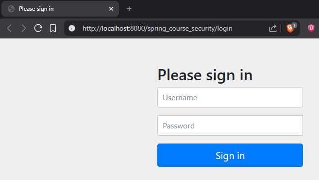
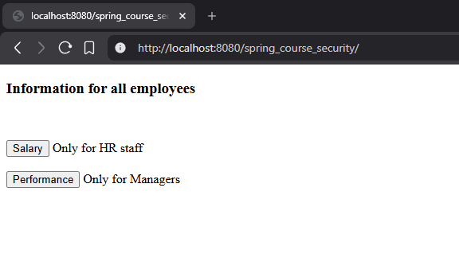

# 🔐 Spring Security Role-Based Authorization (JSP)

📚 Educational project demonstrating role-based access control using Spring Security (without Spring Boot)

This is a classic Spring MVC web application that showcases how authentication and authorization work in Spring Security using a database-backed user store.

The main goal of the project is to demonstrate how different users see different parts of the UI depending on their roles.


## 📌 Project Overview

This application is built using:

- Spring MVC (classic, non-Spring Boot)
- Spring Security
- JSP (Java Server Pages)
- MySQL database for authentication

The application uses role-based authorization:

- Users authenticate via login form
- Roles are stored in the database
- Access to pages and UI elements is restricted based on roles
  
---

## ✨ Features

- 🔐 Authentication via database (users + roles)
- 👥 Role-based authorization (EMPLOYEE, HR, MANAGER)
- 🎯 Conditional rendering of UI elements using Spring Security tags
- 🧩 Classic Spring configuration (no auto-configuration)
- 🌐 JSP-based views
- 📦 WAR deployment to Apache Tomcat

---

## Screenshots

### Authentication page


### Employee Dashboard

---

## 🛠 Requirements

- ☕ Java 8 or higher
- 📦 Maven
- 🐬 MySQL 8.x
- 🐱 Apache Tomcat 9.x
- 💡 IntelliJ IDEA (recommended)

---

## 🚀 How to Run

### 1️⃣ Clone the repository

Clone this repository to your local machine:
```bash
git clone https://github.com/Nabuchodon0ssor/spring-security-role-based-auth.git
```

Or download it as a ZIP archive and extract it.

---

### 2️⃣ Open the project in IntelliJ IDEA

- Open IntelliJ IDEA
- Select File → Open
- Choose the root project folder spring-security-role-based-auth
- IntelliJ will automatically detect two Maven modules
- Make sure all Maven dependencies are downloaded successfully

---

### 3️⃣ Install and configure MySQL

Make sure **MySQL is installed and running** on your computer.

- MySQL version: **8.x**
- Default port: **3306**

You can check MySQL installation by running:

```bash
mysql --version
```

Or by opening MySQL Workbench.

---

### 4️⃣ Create a local database

Open MySQL Workbench (or terminal) and run:

```sql
CREATE DATABASE my_db;
USE my_db;
```
Create table
```sql
CREATE TABLE users (
  username varchar(15),
  password varchar(100),
  enabled tinyint(1),
  PRIMARY KEY (username)
) ;

CREATE TABLE authorities (
  username varchar(15),
  authority varchar(25),
  FOREIGN KEY (username) references users(username)
) ;

INSERT INTO my_db.users (username, password, enabled)
VALUES
	('employee', '{noop}employee', 1),
	('hr', '{noop}hr', 1),
	('boss', '{noop}boss', 1);
    
INSERT INTO my_db.authorities (username, authority)
VALUES
	('employee', 'ROLE_EMPLOYEE'),
	('hr', 'ROLE_HR'),
    ('boss', 'ROLE_HR'),
	('boss', 'ROLE_MANAGER');
```

✅ Database is ready.

---

### 5️⃣ Configure database credentials (Server)

Open the configuration class:

```markdown
src/main/java/com/dimapasunkov/spring/security/configuration/MyConfig.java
```

Find the DataSource configuration:


```java
@Bean
    public DataSource dataSource(){
        ComboPooledDataSource dataSource = new ComboPooledDataSource();
        try {
            dataSource.setDriverClass("com.mysql.cj.jdbc.Driver");
            dataSource.setJdbcUrl("jdbc:mysql://localhost:3306/my_db?useSSL=false");
            dataSource.setUser("bestuser");
            dataSource.setPassword("bestuser");
        } catch (PropertyVetoException e) {
            e.printStackTrace();
        }
        return dataSource;
    }
```

You can change the following properties if needed:

setJdbcUrl → database name and connection URL

setUser → MySQL username

setPassword → MySQL password


Make sure the database name matches the one created in MySQL.

---

### 6️⃣ Run the application (Tomcat)

This is a classic Spring MVC application, so it must be deployed to Apache Tomcat.
Steps in IntelliJ IDEA:
- Run → Edit Configurations
- Add Tomcat Server → Local
- Configure Tomcat installation directory

Deployment:
- Add artifact: spring_course_security:war explodedd
- Application context: /spring_course_security
- Start the server (run Tomcat)

---

### 7️⃣ Open in browser
```markdown
http://localhost:8080/spring_course_security/login
```

### 👤 Test Users
| Username | Password | Roles       |
| -------- | -------- | ----------- |
| employee | employee | EMPLOYEE    |
| hr       | hr       | HR          |
| boss     | boss     | HR, MANAGER |

---

### ℹ️ Important Notes

- ❗ This is a non-Spring Boot project
- ⚙️ Configuration is fully manual (Java Config + web.xml)
- 🧪 Passwords use {noop} encoder for simplicity (not for production)
- 🎓 Built for learning and understanding Spring Security internals

